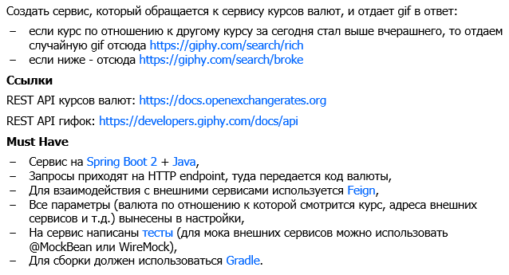

## Задание

## Команды для сборки и запуска проекта

* Клонирование проекта

  `git clone https://github.com/ignal1/alfa.git`

* Сборка проекта (предварительно в терминале нужно перейти в директорию проекта)
  
  `docker build -t alfa .`
  
* Запуск проекта

  `docker run -it -p 8080:8080 alfa`
  
* Для остановки проекта в терминале нужно нажать `Ctrl + C`.
  
Приложение использует порт **8080**.

Для корректной работы приложения требуется JDK версии 9 или выше.

## Endpoints

* `GET /{currency}` -  возвращает случайную gif с ресурса giphy.com из категории rich или broke в зависимости от того, вырос или опустился сегодняшний курс валюты, переданный в пути запроса, по отношению к вчерашнему курсу. Курс рассчитывается по отношению к валюте, установленной в файле настроек (сейчас установлен рубль).

   Пример запроса: `localhost:8080/AUD`

## Комментарии

* В конфигурационный файл вынесены URL и секретные ключи внешних сервисов, валюта по отношению к которой рассчитывается курс;

* Код валюты, курс которой нужно оценить, передается в URL. Например, если нужно определить, вырос или упал курс австралийского доллара по отношению к рублю, запрос будет следующий: `localhost:8080/AUD`;

* Сервисные классы снабжены тестами (использована библиотека  **WireMock**).